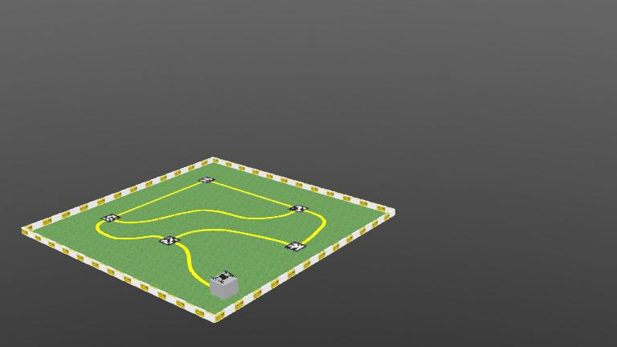

# ArduPilot SITL with Webots

Run Iris quadcopter simulation with ArduPilot SITL + Webots 



## About This Repository

This repository contains:
- **Webots simulation files** in the `Webots/` folder (worlds, controllers, protos)
- **Containerized ArduPilot SITL** setup for easy deployment
- **Helper scripts** to run the simulation with minimal configuration

**We strongly recommend using the containerized version** to avoid installation overhead and compatibility issues. While you can install Webots and ArduPilot manually if preferred, the containerized approach ensures a consistent environment.

The drone configuration uses the same Iris quadcopter from ArduPilot's default examples, so it should work without parameter modifications.

> [!IMPORTANT]
> **Navigation scripts will be graded using the container version.** Please ensure your code works with this setup.

## Your Task

Create a control script to navigate the drone and complete the objectives described in the task [booklet](https://robo.cse.mrt.ac.lk/university) (Phase 2: Drone Airport Navigation). 

### Phase 2 — Drone Airport Navigation (summary)

- World: `Webots/worlds/iris_Task_2.wbt`
- New task: Navigate the environment following the yellow guiding line and use AprilTags on landing pads to identify airports and landing status.
- The solution must be implemented in Python at `Task/flight.py`. Evaluators will change the `Airports = []` variable in your script when testing.

### Implementation Options

Solutions must be implemented in Python. Compiled languages (e.g., C++) may be allowed only with prior approval from the technical committee — request approval before proceeding.

#### Python Implementation
- Create your script at `./Task/flight.py`
- Include all dependencies in `requirements.txt`
- Run with: `python3 Task/flight.py`

### Workflow

1. Complete the setup (see Quick Start below)
2. Start the simulation and ArduPilot (using `./start.sh` or manually)
3. Open Webots and press ▶ (Play)
4. Run your solution script

## Requirements

- **Linux** (Ubuntu 22.04/24.04, Fedora, Debian 12+ recommended)
- **Webots R2025a** installed and working ([installation guide](https://cyberbotics.com/doc/guide/installation-procedure))
- **Podman** (recommended) or Docker

> **Note:** For Windows installation instructions, see [WINDOWS_INSTALLATION.md](WINDOWS_INSTALLATION.md)

## Quick Start

### Option A: Automatic Setup (Recommended)

Run the interactive setup script that handles everything:

```bash
git clone https://github.com/IESL-RoboGames/IESL-RoboGames-Uni-Phase1.git
cd IESL-RoboGames-Uni-Phase1
sudo ./setup.sh
```

The script will:
- Detect your Linux distro and package manager
- Let you choose between Podman (recommended) or Docker
- Install all dependencies step-by-step with your confirmation
- Create the `.env` configuration file

After setup completes, skip to **Step 4: Start the Simulation**.

---

### Option B: Manual Installation

#### 1. Install Podman (one-time)

**Ubuntu/Debian:**
```bash
sudo apt update && sudo apt install -y podman podman-compose
```

**Fedora:**
```bash
sudo dnf install -y podman podman-compose
```

**Arch:**
```bash
sudo pacman -S podman podman-compose
```

Verify installation:
```bash
podman --version && podman-compose --version
```

#### 2. Clone and Configure

```bash
git clone https://github.com/IESL-RoboGames/IESL-RoboGames-Uni-Phase1.git
cd IESL-RoboGames-Uni-Phase1

# Copy environment template and adjust paths if needed
cp .env.example .env
```

Open the .env file and update values if required (paths may vary depending on how Webots is installed).

**For Snap installation:**
```bash
WEBOTS_HOME=/snap/webots/current/usr/share/webots
WEBOTS_TMP_PATH=~/snap/webots/common/tmp/webots
```

**For standard installation:**
```bash
WEBOTS_HOME=/usr/local/webots
WEBOTS_TMP_PATH=/tmp/webots
```

**Note:** Check your display value with `echo $DISPLAY` and update if different.

```bash
export DISPLAY=:0   # add your value by executing `echo $DISPLAY`
```
#### 3. Set Up Python Environment (one-time)

```bash
python3 -m venv venv
source venv/bin/activate
pip install --upgrade pip
pip install -r requirements.txt
```

### Step 4: Start the Simulation

```bash
./start.sh
```

This script automatically:
- Detects and uses Podman or Docker
- Starts the simulation containers
- Opens the MAVProxy GUI in your browser (via noVNC)

### Step 5: Run the Simulation

1. **Open Webots** and load the world:
   ```bash
   webots Webots/worlds/iris_Task_2.wbt
   ```
   Press ▶ (Play) to start

2. **Run the flight script** (in a new terminal):
   Run your solution (if you are using python, ensure it is implemented at ./Task/flight.py). 

   ```bash
   python3 Task/flight.py
   ```

### Step 6: Stop the Simulation

```bash
./stop.sh
```

---

## Alternative: Using Docker

If you prefer Docker over Podman:

1. Install Docker: [Official Docker Installation](https://docs.docker.com/engine/install/)

2. Add yourself to the docker group:
   ```bash
   sudo usermod -aG docker $USER && newgrp docker
   ```

3. Use Docker Compose:
   ```bash
   docker compose up -d --build   # Start
   docker compose down            # Stop
   ```

---

## Quick Test

Verify SITL is running:
```bash
python -c "from pymavlink import mavutil; m = mavutil.mavlink_connection('tcp:localhost:5760'); m.wait_heartbeat(); print('✅ SITL connected!')"
```

---

## Architecture

| Component | Description |
|-----------|-------------|
| **Host** | Runs Webots simulator |
| **webots-controller** | Bridges Webots ↔ ArduPilot |
| **ardupilot-sitl** | ArduPilot SITL simulation |

### Ports

| Port | Service |
|------|---------|
| 6080 | noVNC web interface (MAVProxy GUI) |
| 5599 | Camera stream |
| 5760 | MAVLink primary |
| 5762-5763 | MAVLink secondary/tertiary |
| 14550-14551 | MAVLink UDP (GCS) |

---

## Connecting from Code

### PyMAVLink
```python
from pymavlink import mavutil

master = mavutil.mavlink_connection('tcp:localhost:5760')
master.wait_heartbeat()
print("Connected to ArduPilot SITL")
```

### DroneKit
```python
from dronekit import connect

vehicle = connect('tcp:localhost:5760', wait_ready=True)
print(f"Connected: {vehicle.version}")
```

[for further details](./Task/README.md)

---

## Advanced Usage

<details>
<summary>Click to expand</summary>

### View Logs
```bash
podman-compose logs -f              # All services
podman-compose logs -f ardupilot-sitl   # Specific service
```

### Restart Services
```bash
podman-compose restart webots-controller
podman-compose restart ardupilot-sitl
```

### Start Services Separately
```bash
podman-compose up -d ardupilot-sitl     # SITL only
podman-compose up -d webots-controller  # Controller only
```

### Rebuild Containers
```bash
podman-compose build --no-cache
```
</details>

---

## Troubleshooting

**Quick fixes:**
- **Connection refused?** → Wait for SITL to fully initialize (~30 seconds)
- **Webots not finding controller?** → Check `.env` paths match your installation
